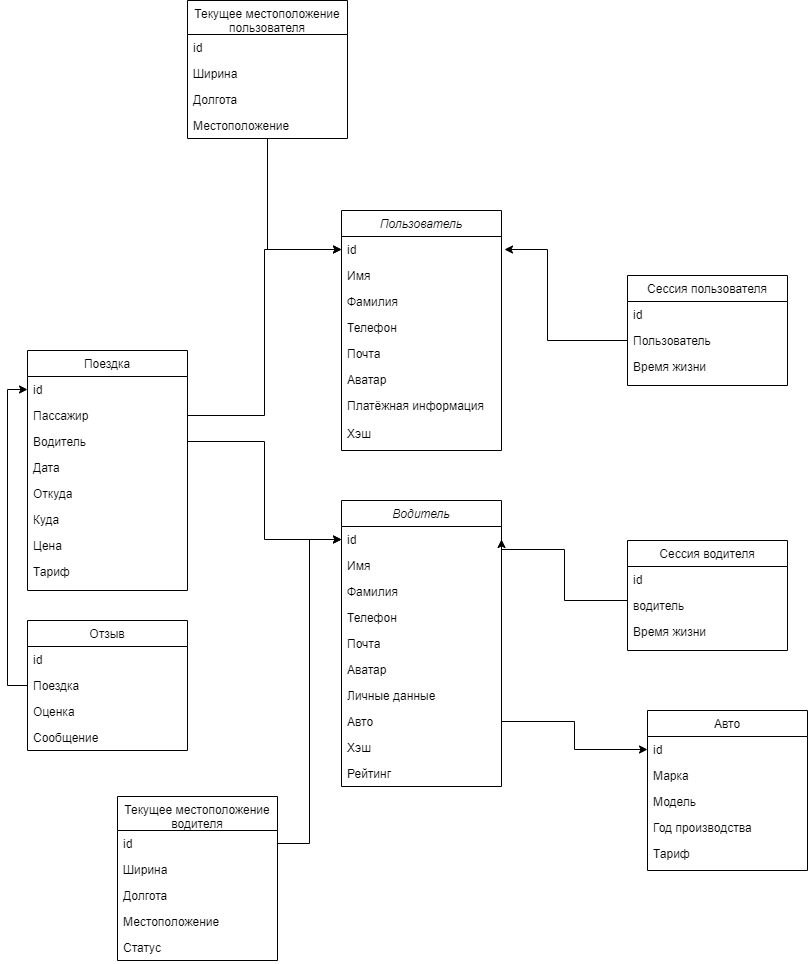

# Такси
## 1. Целевая аудитория
* Сегменты: Россия.
* Количество активных пользоваетелей в месяц ~ 50-55  млн
* В возрастная категория: 18-60 лет

## MVP
* Регистрация и авторизация пользователя
* Регистрация и авторизация водителя
* Заказ такси пользователем
* Получение заказа водителем

## 2. Рассчёт нагрузки
Рынок такси в 2020 году [cоответсвует](https://marketing.rbc.ru/articles/12202/#:~:text=%D0%BF%D0%BE%20%D0%B4%D0%B0%D0%BD%D0%BD%D1%8B%D0%BC%20%C2%AB%D0%B0%D0%BD%D0%B0%D0%BB%D0%B8%D0%B7%D0%B0%20%D1%80%D1%8B%D0%BD%D0%BA%D0%B0%20%D1%82%D0%B0%D0%BA%D1%81%D0%B8%20%D0%B2%20%D1%80%D0%BE%D1%81%D1%81%D0%B8%D0%B8%C2%BB%2C%20) рынку такси в 2018 и кол-во поездок в день ~ 7млн. Кол-во поездок в сутки в Москве состовляет [~900тыс](https://ru.wikipedia.org/wiki/%D0%A2%D0%B0%D0%BA%D1%81%D0%B8_%D0%B2_%D0%9C%D0%BE%D1%81%D0%BA%D0%B2%D0%B5#:~:text=890%20%D1%82%D1%8B%D1%81.), где доля яндекса составляет [70%](https://vc.ru/transport/184077-deptrans-moskvy-dolya-yandeks-taksi-v-zakazah-za-sutki-vyrosla-do-70-8-v-noyabre-na-3-bolshe-chem-v-iyune#:~:text=%D0%B4%D0%B5%D0%BF%D1%82%D1%80%D0%B0%D0%BD%D1%81%20%D0%BC%D0%BE%D1%81%D0%BA%D0%B2%D1%8B%3A%20%D0%B4%D0%BE%D0%BB%D1%8F%20%C2%AB%D1%8F%D0%BD%D0%B4%D0%B5%D0%BA%D1%81.%D1%82%D0%B0%D0%BA%D1%81%D0%B8%C2%BB%20%D0%B2%20%D0%B7%D0%B0%D0%BA%D0%B0%D0%B7%D0%B0%D1%85%20%D0%B7%D0%B0%20%D1%81%D1%83%D1%82%D0%BA%D0%B8%20%D0%B2%D1%8B%D1%80%D0%BE%D1%81%D0%BB%D0%B0%20%D0%B4%D0%BE%2070%2C8%25%20%D0%B2%20%D0%BD%D0%BE%D1%8F%D0%B1%D1%80%D0%B5%20%E2%80%94%20%D0%BD%D0%B0%203%25%20%D0%B1%D0%BE%D0%BB%D1%8C%D1%88%D0%B5%2C%20%D1%87%D0%B5%D0%BC%20%D0%B2%20%D0%B8%D1%8E%D0%BD%D0%B5%20). В России доля яндекса составляет [27%](https://www.vedomosti.ru/business/articles/2020/06/11/832466-yandekstaksi-vezet#:~:text=%D1%8F%D0%BD%D0%B4%D0%B5%D0%BA%D1%81.%D1%82%D0%B0%D0%BA%D1%81%D0%B8%C2%BB%20%E2%80%93%20%D0%BA%D1%80%D1%83%D0%BF%D0%BD%D0%B5%D0%B8%D1%88%D0%B8%D0%B8%20%D0%B8%D0%BD%D1%82%D0%B5%D1%80%D0%BD%D0%B5%D1%82-%D1%81%D0%B5%D1%80%D0%B2%D0%B8%D1%81%20%D0%B7%D0%B0%D0%BA%D0%B0%D0%B7%D0%B0%20%D1%82%D0%B0%D0%BA%D1%81%D0%B8%20%D0%B2%20%D1%80%D0%BE%D1%81%D1%81%D0%B8%D0%B8.%20%D0%B0%D0%BD%D0%B0%D0%BB%D0%B8%D1%82%D0%B8%D1%87%D0%B5%D1%81%D0%BA%D0%B8%D0%B8%20%D1%86%D0%B5%D0%BD%D1%82%D1%80%20%D0%BF%D1%80%D0%B8%20%D0%BF%D1%80%D0%B0%D0%B2%D0%B8%D1%82%D0%B5%D0%BB%D1%8C%D1%81%D1%82%D0%B2%D0%B5%20%D1%80%D0%BE%D1%81%D1%81%D0%B8%D0%B8%20%D0%B2%202019%20%D0%B3.%20%D0%BE%D1%86%D0%B5%D0%BD%D0%B8%D0%B2%D0%B0%D0%BB%20%D0%B4%D0%BE%D0%BB%D1%8E%20%D1%8D%D1%82%D0%BE%D0%B3%D0%BE%20%D1%81%D0%B5%D1%80%D0%B2%D0%B8%D1%81%D0%B0%20%D0%BD%D0%B0%20%D1%80%D0%BE%D1%81%D1%81%D0%B8%D0%B8%D1%81%D0%BA%D0%BE%D0%BC%20%D1%80%D1%8B%D0%BD%D0%BA%D0%B5%20%D0%B2%2027%25). Отсюда следует что доля яндекса по всей России ~ 42%, итого ~ 3млн поездок в день. Треть пользуется такси ~ 20 раз месяц, оставщаяся часть ~2 раза в месяц [источник](https://rg.ru/2019/10/01/rossiiane-stali-chashche-polzovatsia-uslugami-taksi.html#:~:text=%20%D0%BE%D0%BA%D0%BE%D0%BB%D0%BE%20%D0%BF%D0%BE%D0%BB%D0%BE%D0%B2%D0%B8%D0%BD%D1%8B%20%D1%83%D1%87%D0%B0%D1%81%D1%82%D0%BD%D0%B8%D0%BA%D0%BE%D0%B2%20%D0%BE%D0%BF%D1%80%D0%BE%D1%81%D0%B0%20%D1%81%D0%BE%D0%BE%D0%B1%D1%89%D0%B8%D0%BB%D0%B8%2C%20%D1%87%D1%82%D0%BE%20%D0%B2%D1%8B%D0%B7%D1%8B%D0%B2%D0%B0%D1%8E%D1%82%20%D0%BC%D0%B0%D1%88%D0%B8%D0%BD%D1%83%20%D0%BE%D0%B4%D0%B8%D0%BD%20%D0%B8%D0%BB%D0%B8%20%D0%BD%D0%B5%D1%81%D0%BA%D0%BE%D0%BB%D1%8C%D0%BA%D0%BE%20%D1%80%D0%B0%D0%B7%20%D0%B2%20%D0%BC%D0%B5%D1%81%D1%8F%D1%86.%20%D1%87%D0%B5%D1%82%D0%B2%D0%B5%D1%80%D1%82%D1%8C%20%D1%80%D0%B5%D1%81%D0%BF%D0%BE%D0%BD%D0%B4%D0%B5%D0%BD%D1%82%D0%BE%D0%B2%20%D0%BF%D1%80%D0%B8%D0%B7%D0%BD%D0%B0%D0%BB%D0%B8%D1%81%D1%8C%2C%20%D1%87%D1%82%D0%BE%20%D0%B4%D0%B5%D0%BB%D0%B0%D1%8E%D1%82%20%D1%8D%D1%82%D0%BE%20%D0%BD%D0%B5%D1%81%D0%BA%D0%BE%D0%BB%D1%8C%D0%BA%D0%BE%20%D1%80%D0%B0%D0%B7%20%D0%B2%20%D0%BD%D0%B5%D0%B4%D0%B5%D0%BB%D1%8E%20%D0%B8%20%D1%87%D0%B0%D1%89%D0%B5.), итого кол-во уникальных пользователей в месяц ~ 50-55 млн. Таким образом кол-во уникальных пользователей в день ~ 10 млн и около 500 тыс водителей.

Каждый пользователь в среднем пользуется сервисом ~ 1-2 раза в день(в среднем 1.5 раза).
### Сценарий одного использования для пользователя:
* Авторизация или регистрация: 0-1 раз (в среднем 0.5)
* Заказ такси: 1 раз
* Отзыв и оценка водителя: 0-1 раз (в среднем 0.5)

### Сценарий одного использования для водителя:
* Авторизация или регистрация: 0-1 раз (в среднем 0.5)
* Выход на линию: 1 раз
* Получение заказа: в среднем [20 заказов](https://iz.ru/876402/2019-05-08/nazvana-sredniaia-prodolzhitelnost-poezdki-na-taksi-v-moskve#:~:text=%D0%BF%D0%BE%D0%B5%D0%B7%D0%B4%D0%BA%D0%B0%20%D0%BD%D0%B0%20%D1%82%D0%B0%D0%BA%D1%81%D0%B8%20%D0%B2%20%D0%BC%D0%BE%D1%81%D0%BA%D0%B2%D0%B5%20%D0%B2%20%D1%81%D1%80%D0%B5%D0%B4%D0%BD%D0%B5%D0%BC%20%D0%B4%D0%BB%D0%B8%D1%82%D1%81%D1%8F%2021%20%D0%BC%D0%B8%D0%BD%D1%83%D1%82%D1%83)
* Конец работы: 1 раз

Итого кол-во основных действий за день 2*1.5 = 3.75 для пользователя и 17.5 для водителя. Так же необходимо учесть отправку местоположения(широты и долготы) водителем на сервер в секунду, 500тыс = 500 тыс RPS от водителей и в процессе ожиданий 7-10мин пользователем получается около 100 тыс RPS. Итого 3.75 * 20млн + 17.5 * 120тыс = 77 млн запросов(без учётка отправки местоположения).Разделив предидущее значение на 86 400 и прибавив отправку местоположения, отсюда получается RPS ~ 600тыс

### RPS по разным видам запросов
* Авторизация и регистрация(для пользователей и водителей) ~ 300
* Заказ такси(для пользователей) ~ 500
* Отзыв(для пользователей) ~ 200
* Выход и заверешение(для водителей) ~ 20
* Получение заказа ~ 200

### Нагрузка:
* Отправка геопозиции: Ширина и Долгота имеют размер в [8 байта](https://developers.google.com/maps/documentation/javascript/mysql-to-maps#:~:text=%60lat%60%20float(%2010%2C%206%20)%20not%20null%20%2C%20%60lng%60%20float(%2010%2C%206%20)%20not%20null%20%2C) каждый, так же передаётся id водителя 4 байта.
Итого: 50*(500тыс+100тыс) = 22 млн байт/c или ~20 млн Мб/день.
* Остальное ~1млн Мб/день

Тогда в день обьём передаваемых данных ~21 млн Мб/день

## 3.Логическая схема БД
Основные сущьности Пользователь, Водитель, Поездка.

## 5. Физическая системы хранения
Данные о пользователях, водителях и поездках имеют для нас наибольший приоритет, потому что без них наше приложение потеряет ключевой функционал. Для хранения этих данных я выбрал PostgreSQL, как наиболее функциональную и надежную реляционную базу данных.

Активные сессии пользователя будем хранить в redis. Redis имеет встроенный API для работы с Memcached, что позволяет использовать эффективное кэширование данных. А так же неблокирующую master-slave репликацию.

А для хранения геоданных бдуем использовать MongoDB. Тк она имеет встроеные методы для работы с гео хешами. [Источник](https://habr.com/ru/post/228023/#:~:text=%D0%BC%D0%BD%D0%BE%D0%B3%D0%B8%D0%B5%20%D1%82%D0%B5%D1%85%D0%BD%D0%BE%D0%BB%D0%BE%D0%B3%D0%B8%D0%B8%20%D1%83%D0%B6%D0%B5%20%D0%B8%D0%BC%D0%B5%D1%8E%D1%82%20%D0%B2%D1%81%D1%82%D1%80%D0%BE%D0%B5%D0%BD%D0%BD%D1%8B%D0%B5%20%D0%BC%D0%B5%D1%82%D0%BE%D0%B4%D1%8B%20%D0%B4%D0%BB%D1%8F%20%D1%80%D0%B0%D0%B1%D0%BE%D1%82%D1%8B%20%D1%81%20%D0%B3%D0%B5%D0%BE-%D1%85%D0%B5%D1%88%D0%B0%D0%BC%D0%B8%2C%20%D0%BD%D0%B0%D0%BF%D1%80%D0%B8%D0%BC%D0%B5%D1%80%2C%20mongodb.)

## 6. Выбор технологий.

### Backend
Golang. Перспективный язык программирования, со статической типизацией, эффективной многопоточностью, использующий аналог корутин(горутины), а так же удобным менеджером зависимостей (gomod).

Также можно прибегнуть к микросервисной архитектуре. Она имеет свои недостатки, но серьезно повышает характеристики масштабируемости и отказоустойчивости.

### Протоколы взаимодействия
Протокол связи между фронтендом и бэкендом - https, данные будут передаваться в формате json.Общение между микросервисами на бэкенде будет осуществляться по протоколу gRPC, данные будут передаваться в формате protobuf

### Обеспечение качества
Как на фронтенде, так и на бэкенде будут использованы статические и динамические анализаторы кода, интеграционные и юнит тесты. Их запуск будет автоматизирован в Gitlab CI.

### Frontend
web client:
CSS, HTML , JavaScript - как стандарт Frontend разработки. Webpack — Это сборщик модулей JavaScript с открытым исходным кодом он принимает модули с зависимостями и генерирует статические ресурсы, представляющие эти модули. Sass - метаязык на основе CSS, предназначенный для увеличения уровня абстракции CSS-кода и упрощения файлов каскадных таблиц стилей. React - обеспечивающий модульность, быстрый рендеринг, высокую run-time производительность.

smartphone app: swift для ios и java для android

